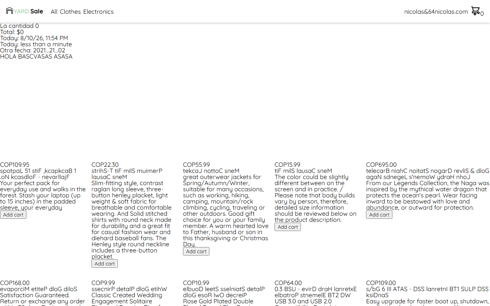

# MyStore

> A small online store built with Angular to practice core framework concepts: components, inputs/outputs, lifecycle hooks, custom pipes, directives, and services consuming a real API.



---

## 🧩 Problem / Context

Learning project to get hands-on with Angular fundamentals beyond tutorials: component communication, reactivity, custom pipes/directives, and consuming a public REST API — while progressively adding linting and good practices.

---

## 🛠️ Stack

| Layer      | Technology                          |
|------------|--------------------------------------|
| Frontend   | Angular 18 (standalone components)   |
| HTTP       | Angular HttpClient + [Fake Store API](https://fakestoreapi.com/) |
| Testing    | Karma + Jasmine                      |
| Linting    | ESLint + angular-eslint              |

---

## 🏗️ Architecture

- Standalone components (no NgModules) for `nav`, `products`, `product`, and `img`.
- `ProductsService` isolates HTTP access to the Fake Store API from the components.
- Custom pipes (`reverse`, `time-ago`) and a custom `highlight` directive built from scratch to understand the underlying APIs instead of relying on Angular Material/CDK.

---

## 🧠 Technical challenges & decisions

- **Problem:** Needed to understand data flow between parent/child components → **Solution:** Practiced `@Input`/`@Output` and lifecycle hooks (`ngOnInit`, `ngOnChanges`) manually in the `product`/`products` components → **Why:** Building this by hand (instead of jumping to signals/state libraries) makes the underlying change-detection mechanics clear.
- **Problem:** Wanted real reactive behavior beyond static mock data → **Solution:** Consumed the public Fake Store API via `HttpClient` in `ProductsService` → **Why:** Working against a real async source surfaces loading/error states that mock arrays hide.
- **Problem:** Repetition and inconsistent style creeping into components → **Solution:** Introduced ESLint + angular-eslint → **Why:** Establish good practices early rather than retrofitting linting on a bigger codebase later.

---

## 🚀 How to run it

```bash
git clone https://github.com/Carlou134/my-store.git
cd my-store
pnpm install
pnpm start
```

Then open `http://localhost:4200/`.
